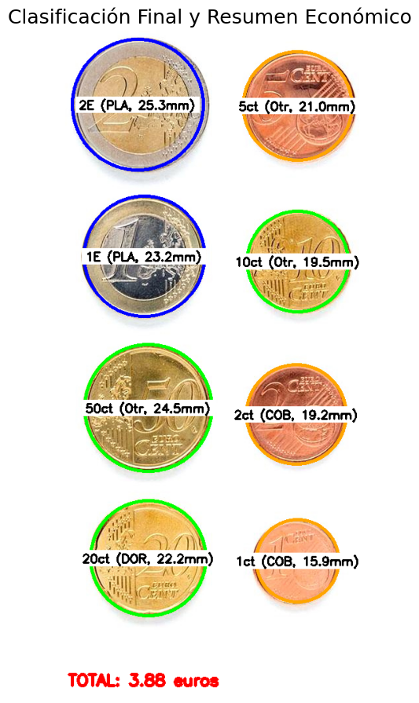
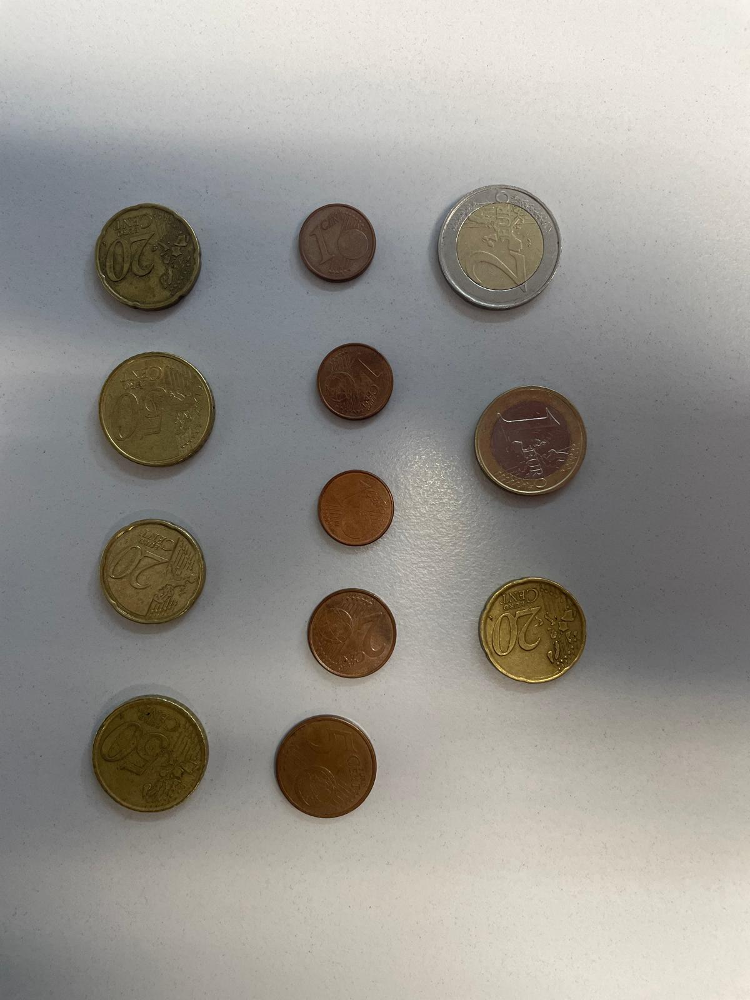
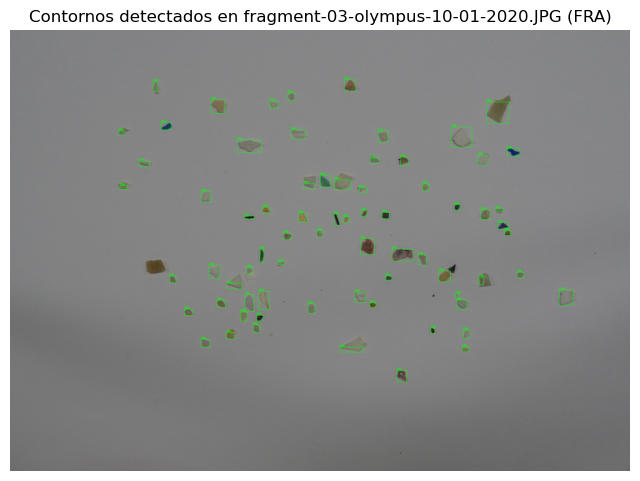

# Clasificación de Objetos en Imágenes

Este proyecto implementa dos tareas distintas para la detección y clasificación de objetos en imágenes: **Clasificación de Contornos** y **Clasificación de Monedas**. Ambas tareas utilizan técnicas de procesamiento de imágenes con OpenCV, análisis de características y clasificación heurística. A continuación, se describen ambas tareas, sus requisitos y cómo ejecutarlas.

## Requisitos
- Python 3.x
- Bibliotecas: OpenCV (`cv2`), NumPy, Pandas, Matplotlib, Seaborn, scikit-learn
- Imágenes de entrada y archivo CSV

## Tarea 1: Clasificación de Monedas
### Descripción
Esta tarea detecta y clasifica monedas en una imagen (`Monedas.jpg`) según su tamaño y color, utilizando una moneda de 1 euro como referencia. Calcula el valor total de las monedas en euros.

### Archivos
- **Imagen de entrada**: `Monedas.jpg`

### Proceso
1. **Detección de círculos**: Utiliza la Transformada de Hough para detectar monedas (círculos) en la imagen.
2. **Selección de referencia**: Mediante una ventana emergente, espera que el usuario seleccione a mano una moneda de 1 euro, para poder utilizarla como referencia en el momento de convertir los radios de los círculos de px a mm.
3. **Clasificación por tamaño**: Compara los radios de los círculos detectados con los radios reales de monedas, localizando los dos vecinos más próximos
4. **Clasificación por color**: Analiza el color RGB promedio en parches alrededor del centro y borde de cada moneda, clasificándolas como cobrizas (monedas de 1, 2 y 5 céntimos), doradas (monedas de 10, 20 y 50 céntimos) o plateadas (realmente bicolores, monedas de 1 y 2 euros).
5. **Clasificación final**: Combina tamaño y color para asignar un valor final a cada moneda (1, 2, 5, 10, 20, 50, 100, 200 céntimos).
6. **Resumen económico**: Calcula el valor total en euros y muestra un resumen.
7. **Visualización**: Genera una imagen con las monedas etiquetadas (valor, color detectado, radio aproximado) y el dinero total.


### Resultado final obtenido
Si bien se ha podido lograr la correcta clasificación de una imagen con condiciones cercanas a perfectas, es complicado que las técnicas utilizadas se puedan trasladar correctamente a otras imágenes con condiciones de brillo y sombras diferentes
## Tarea 2: Clasificación de Microplásticos
### Descripción
Esta tarea detecta y clasifica contornos en imágenes en tres clases: `FRA` (fragmentos), `PEL` (pellets) y `TAR` (alquitrán). Utiliza un enfoque basado en características ponderadas y distancia euclidiana normalizada.

### Archivos
- **Imágenes de entrenamiento**:
  - `fragment-03-olympus-10-01-2020.JPG` (FRA)
  - `pellet-03-olympus-10-01-2020.JPG` (PEL)
  - `tar-03-olympus-10-01-2020.JPG` (TAR)
- **Imagen de prueba**: `MPs_test.jpg`
- **Anotaciones**: `MPs_test_bbs.csv` contiene etiquetas y coordenadas que delimitan los objetos de la imagen de prueba (no es preciso al 100%)

### Proceso
1. **Detección de contornos**: Identifica contornos válidos basándose en rangos de área (`min_area=150`, `max_area=12000`) y evita solapamientos significativos.
2. **Extracción de características**: Calcula las características de: área, perímetro, compacidad, área relativa al contorno, relación de aspecto, relación de ejes, distancia relativa al centroide y distancia al color negro (todos a excepción de la distancia al negro fueron características utilizadas en el trabajo: [SMACC: A System for Microplastics Automatic Counting and Classification](https://doi.org/10.1109/ACCESS.2020.2970498)) de las imágenes de entrenamiento: pellet-03-olympis-10-01-2020.jpg tar-03-olympis-10-01-2020.jpg fragment-03-olympis-10-01-2020.jpg.



3. **Clasificación**: Clasifica contornos usando una distancia euclidiana ponderada y normalizada, comparando con características de entrenamiento. Los pesos para las diferentes características recogidas en el entrenamiento fueron obtenidos mediante prueba y error.

```
feature_weights = {
    "area": 3.5,
    "perimeter": 1.0,
    "compact": 4.5,
    "rel_area_cont": 2.5,
    "rel_aspect": 3.5,
    "rel_axes": 4.0,
    "rel_dist_centroid": 5.5,
    "black_dist": 3.5,
}
```
4. **Evaluación**: Compara predicciones con anotaciones de verdad fundamental (Ground Truth) usando IoU ≥ 0.5 y calcula métricas (precisión, sensibilidad, F1-score).


